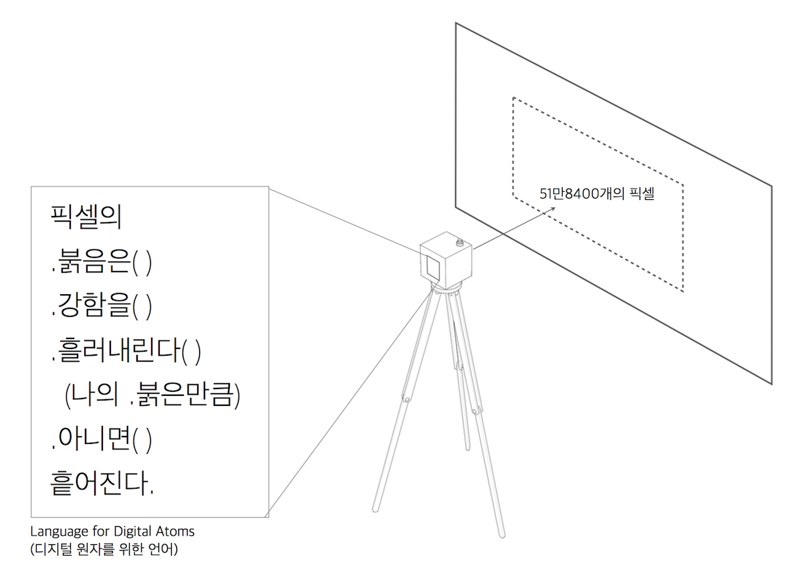
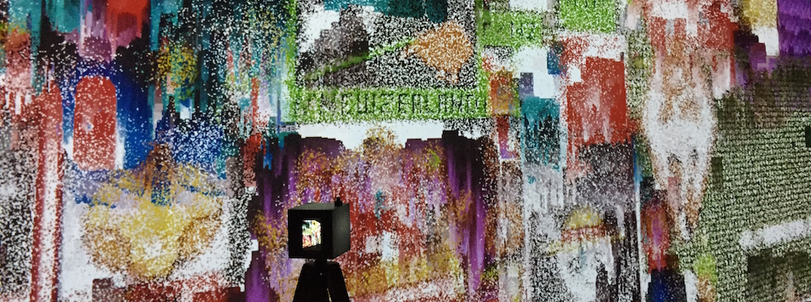
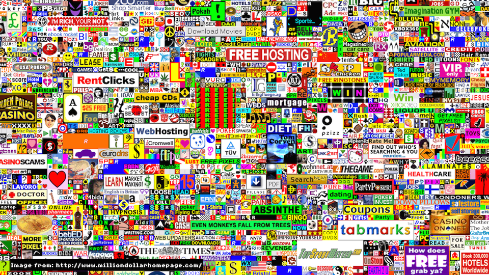

+++

image = "portfolio/metapixels/metapixel_ex.png"
showonlyimage = true
date = "2020-12-24T19:44:32+05:30"
title = "MetaPixels"
draft = false
weight = 2

+++

## 2020
 

<!--more-->

 일반적인 카메라는 대상의 이미지를 찍는다. 그러나 &lt;메타픽셀 피드백&gt;에 설치된 카메라는 대상의 이미지를 찍는 카메라가 아니다. 디지털 이미지의 픽셀을 낯설게 건드리는 여러 대의 카메라를 제작하고, 이들과 디지털 이미지 사이에서 발생하는 일대다 피드백의 설치 작업이다.

 디지털 기술의 발전 초기, 인간과 디지털의 접점에서 도드라지게 보였던 픽셀은 디스플레이 기술의 발전과 층층이 추상화된 그래픽 유저 인터페이스 등으로 이제는 점점 인지하기 힘들어지고 있다. PROTOROOM이 다시 사유해보고자 하는 대상은 픽셀과 같이 이제 점점 비가시적인 것이 되어가는, 디지털 매체의 ‘원자적인’ 존재이다. 즉 물리적 세계의 원자(Atom)에 대응한 반(反)파트너 같던  디지털의 비트(Bits)는 이제 더욱 중층화 되고 고해상도화 되어 가는 세계에서 새롭게 발굴하고 인식해야 할 원자적 존재가 되어 가고 있는 것이다.

  여기에서 픽셀을 기술적인 차원에서 재발굴하기 보다는 커뮤니케이션이 가능한 대상(Object)으로서 메세지를 보낸다.  이 메세지는 디지털의 수면 아래로 숨은 픽셀을 직접, 그러나 낯설게 감각하고 소통하는 일종의 언어놀이로 만들어진 카메라로 이뤄진다.

 >>**셔터를 누르는 순간 카메라가 바라보는 이미지 속의 수많은 픽셀들에게 메시지가 전달된다.**

 이를 통해 이미지를 구성하는 부분적 요소로서만 존재하던 각각의 픽셀들이 메시지를 받아 행동할 수 있는 개별적 존재가 될 수 있게 실험한 작업이다. 픽셀의 행위로 만들어진 새로운 이미지는 다시 카메라들의 입력으로 되먹임되고, 이를 통해 픽셀들은 메타픽셀로서 피드백된다.

## 초기 이미지의 선택

#### <https://draemm.li/various/place-atlas/>

#### <http://www.milliondollarhomepage.com/>

