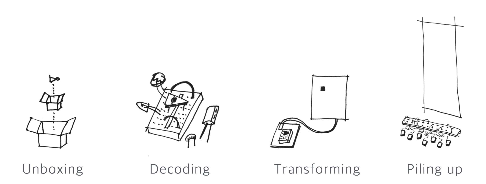
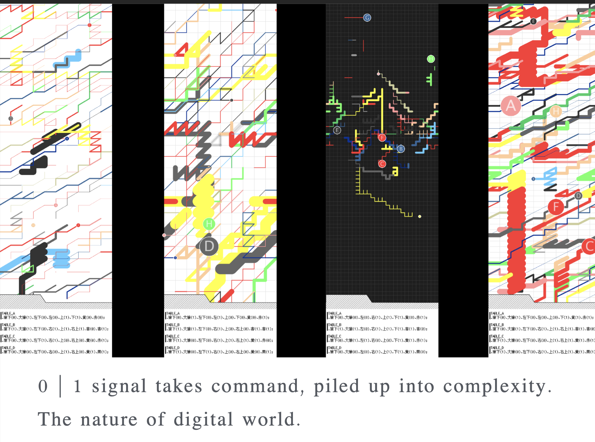

+++
image = "portfolio/smallbig/2019-09-11BTBT.jpg"
showonlyimage = true
date = "2023-01-13T19:44:32+05:30"
title = "01 signal"
draft = false
weight = 3

+++


## <!--more-->

## sensuous transforming of 0 | 1 signal Ver.1 (2016)

* [Media Art as an Awareness Filter-NTT InterCommunication Center (ICC)]( https://www.ntticc.or.jp/en/archive/works/sensuous-transforming-of-0-1-signal-ver-1/)

‘**sensuous transforming of** **0 | 1** **signal**’ is an installation work that allows construction of kits
 that allow experience and contemplation on the elements of computing while converting and transforming the 0,1 bits into different layers through workshop and exhibition.

<!--more-->

<!--more-->

<!--more-->

© 2023 PROTOROOM
