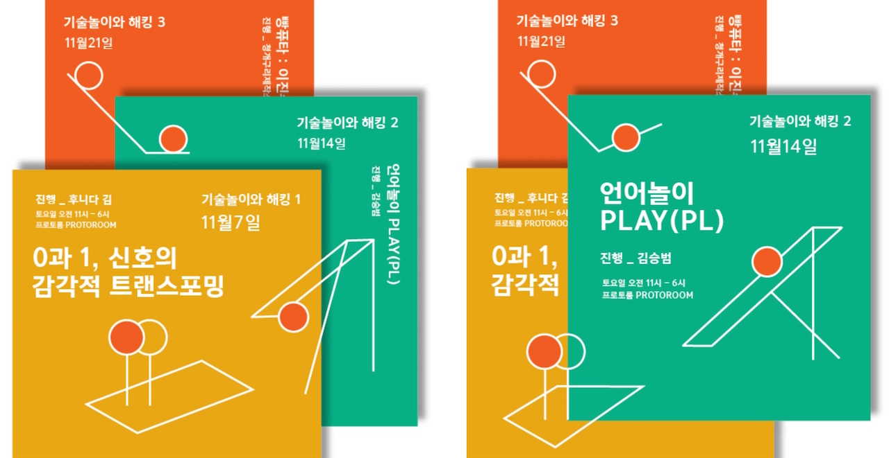
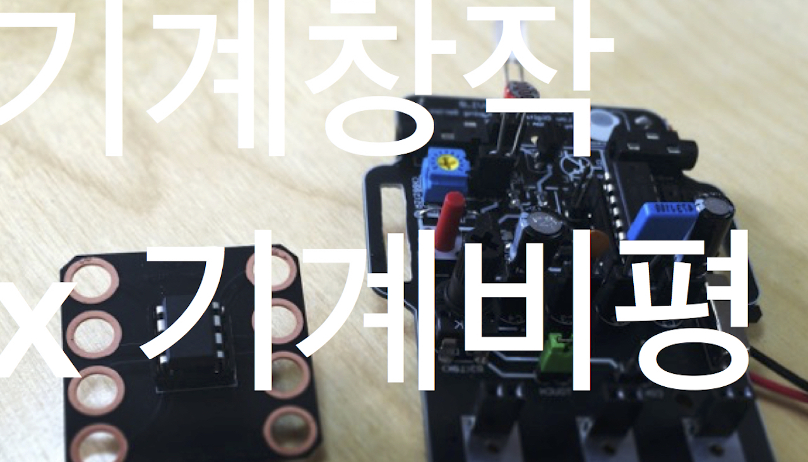
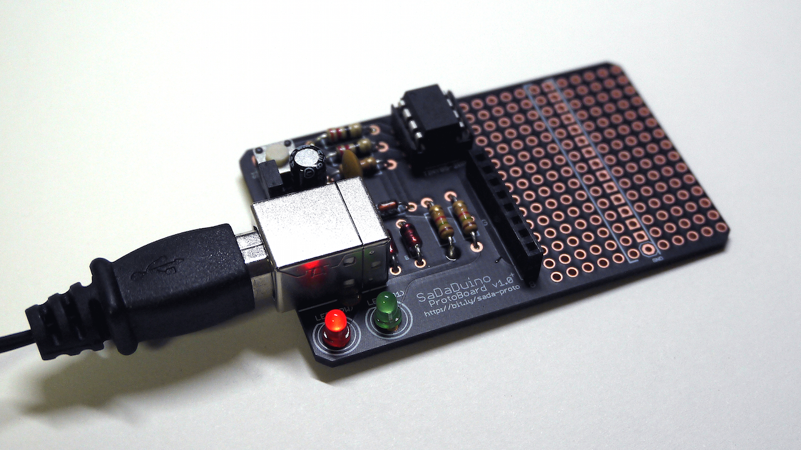
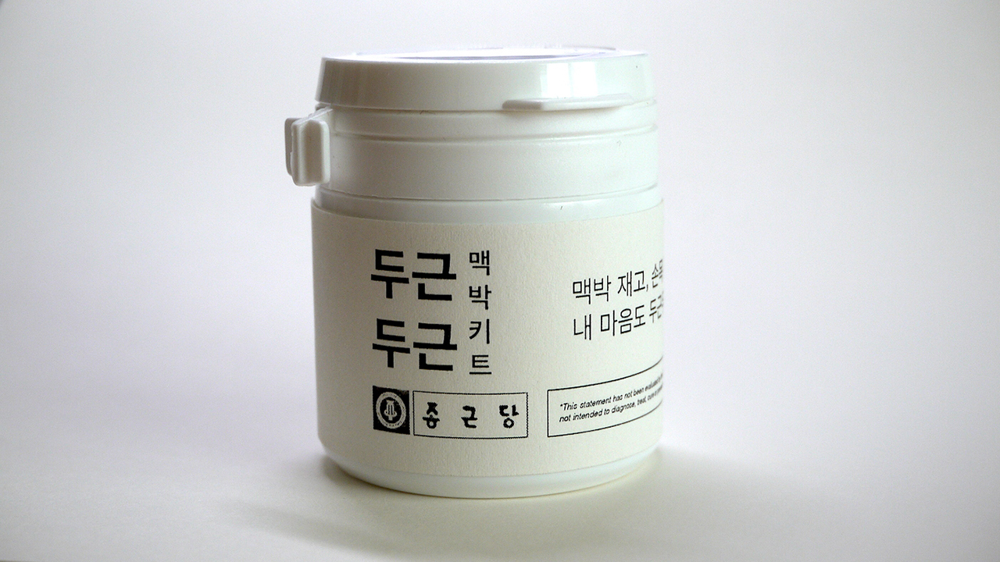
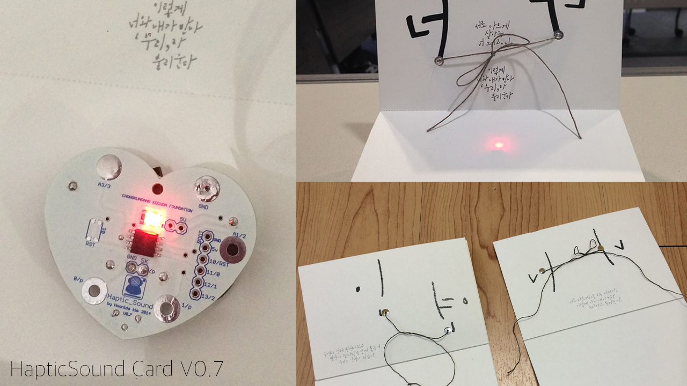
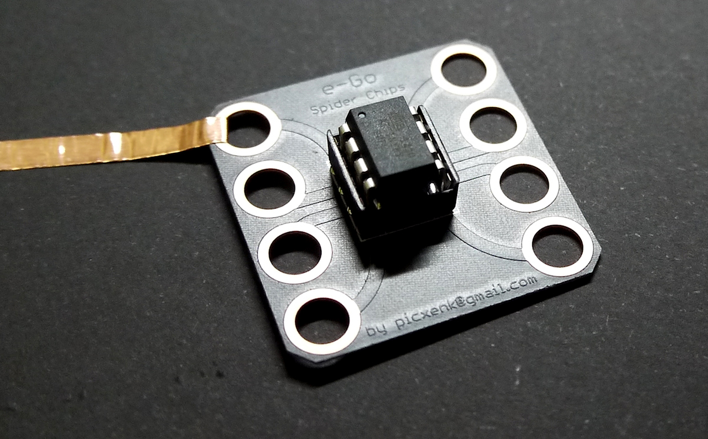
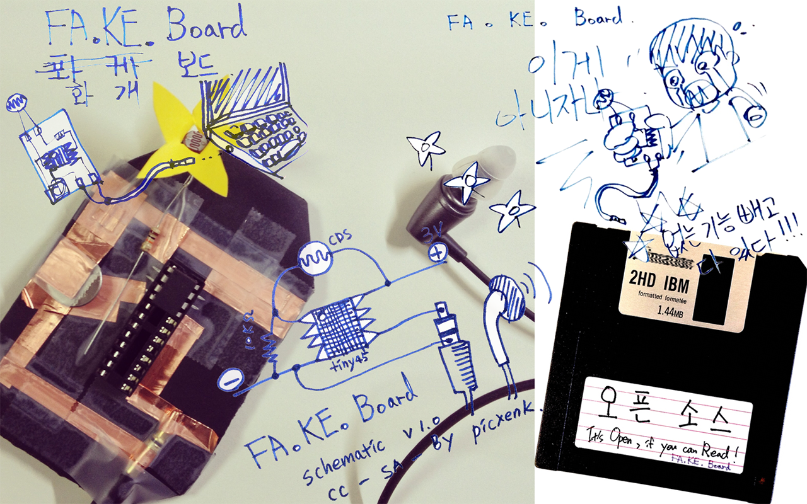
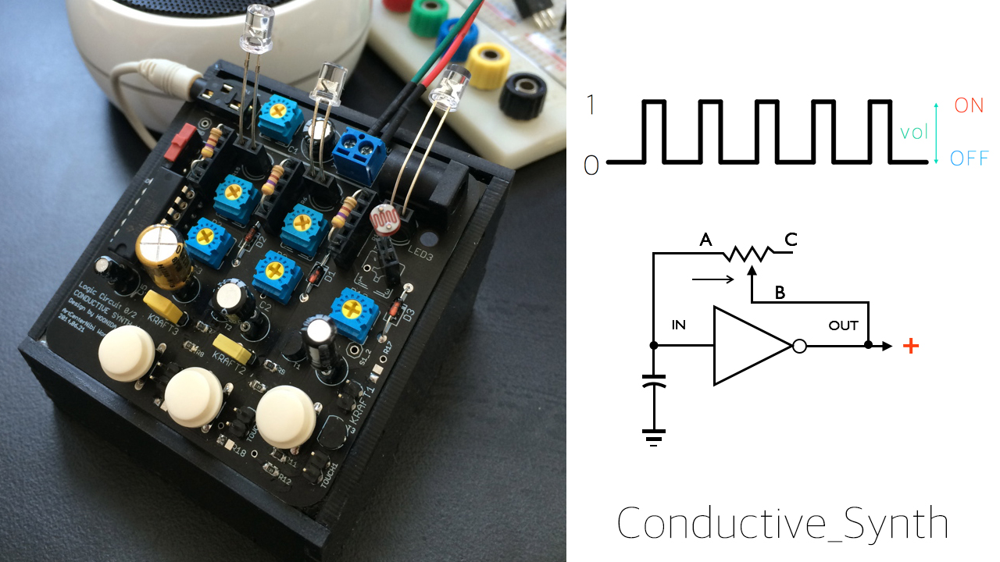

+++

date = "2023-01-13T19:44:32+05:30"
title = "⊙ Kit X Workshop"
draft = false
weight = 200

+++

<!--more-->

SmallBig_SØ, first ideaSketch 2019

## 1nput0utput kit ( NTT ICC ), 2017

## 0과1,신호의 감각적 트랜스포밍 / 언어놀이 PLAY ( 기술놀이와 해킹UnmakeLab ), 2015

## 

## 기계창작 기계비평 (PROTOROOM), 2015

## 01SML_KIT( ACC ), 2015

 

## SaDaDuino( SIA ), 2014

## PulseBug( 종근당 ), 2014

## HapticSound ( 종근당 ), 2014

 

## eGo_spider_chips(  ), 2014

## Low Digital Prototyping Workshop (IAMAS, Art center NABI), 2014

 

 

## MakerFaire_FaKeBoard ( ), 2013

## conductive_Synth, 2013

© 2023 PROTOROOM
