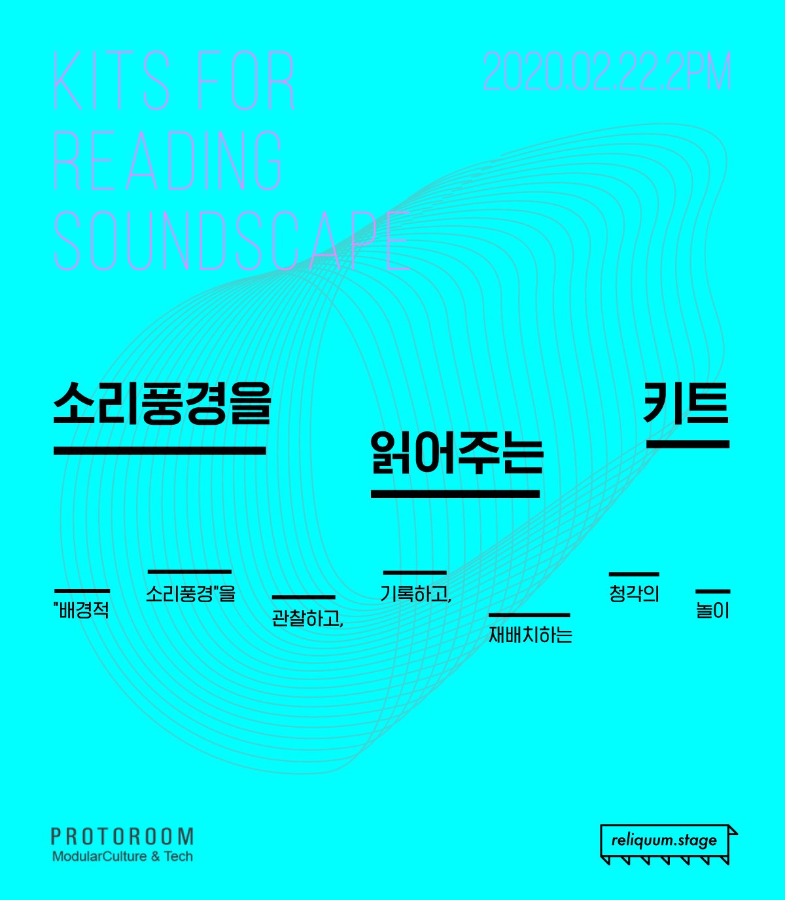
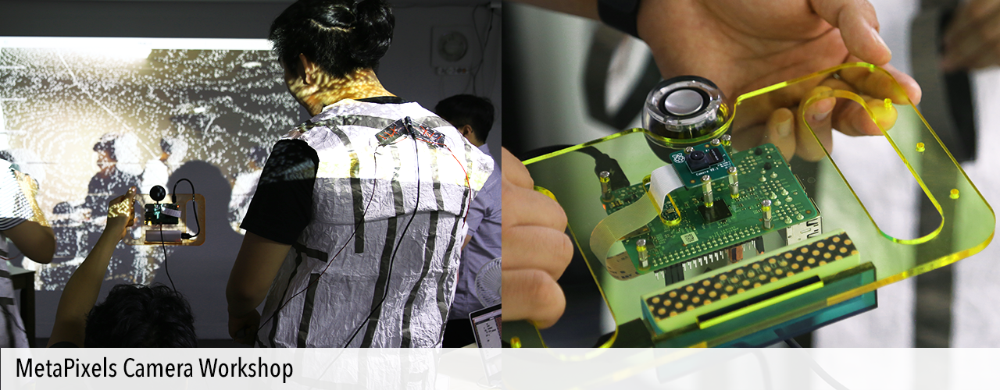
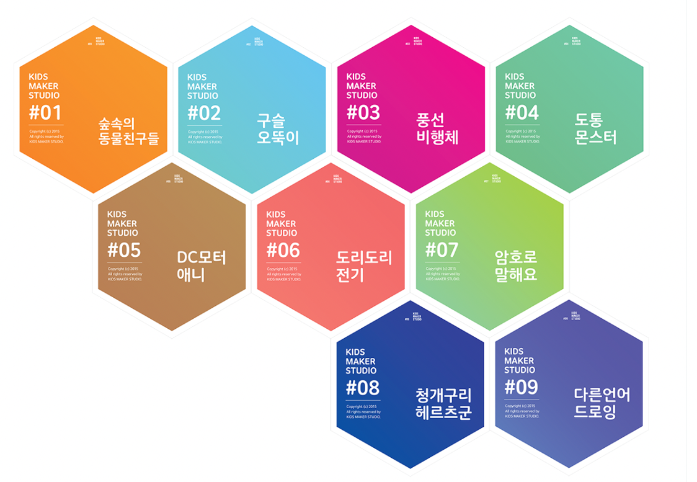

+++

date = "2023-01-13T19:44:32+05:30"
title = "⊙ Kit X Workshop"
draft = false
weight = 200

+++



## KITs for reading soundscape 소리풍경을 읽어주는 키트 ( Reliquum ), 2020

https://reliquum.co.kr/archives/author/reliquum
    

## metapixel_workshop ( Barim ), 2018

    

## 1nput0utput kit ( NTT ICC ), 2017

    

## TinkeringWorkshop( Google.org ), 2015
https://protoroom.kr/TinkeringWorkshop/#!index.md
    

## 0과1,신호의 감각적 트랜스포밍 / 언어놀이 PLAY ( 기술놀이와 해킹 ), 2015

    

## 기계창작 기계비평 (PROTOROOM), 2015

    

## 01SML_KIT( ACC ), 2015

    

## SaDaDuino( SIA ), 2014

    

## PulseBug( 종근당 ), 2014

    

## HapticSound ( 종근당 ), 2014 


    

## eGo_spider_chips(  ), 2014

    

## Low Digital Prototyping Workshop (IAMAS, Art center NABI), 2014



 
    

## MakerFaire_FaKeBoard ( ), 2013

    

## Conductive_Synth, 2013

    

© 2023 PROTOROOM
