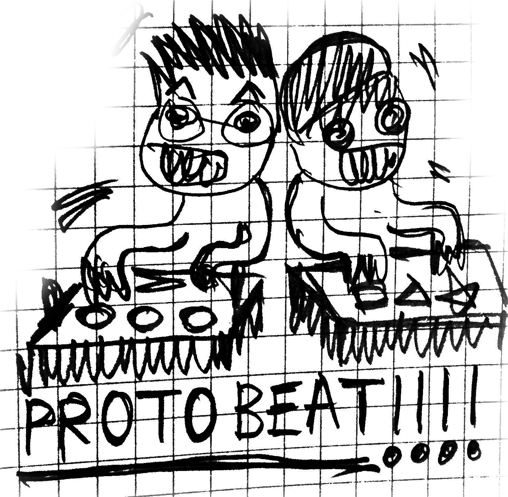

+++
date = "2023-05-19T15:25:32+05:30"
title = "Play Album 01"
draft = false
weight = 2

+++

### SmallBig_SØ Play Album 01

PROTOROOM은 테크놀로지 매체 기반의 키트(KIT)로 작업을 하는 메타미디어 콜렉티브이다. 키트는 컴퓨팅 매체의 근본적인 요소를 직접 감각하는 기회와 함께 생태계의 일부가 된 테크놀로지에 대한 사유와 담론을 가능하게 한다.

SmallBig-SØ는 새로운 방향의 사운드 소비방식을 제시하는 프로덕트이자 악기로, 1KB 이하의 수식 안에서 즐기듯 원하는 사운드 비트를 찾아가는 “탐색적 작곡"이라는 새로운 감각을 담아낸다. 적은 데이터의 조합으로 구성된 수식에서 찾아가는 무한의 사운드 공간은 오늘날 필요 이상의 인공지능, 빅데이터, 고해상도의 음원과 이미지 등 무의미하게 쌓이고 잊히는 과잉의 데이터 속에 무감각해지고 있는 우리에게 새로운 사유의 계기가 되고, 실시간으로 생성되는 감각적인 사운드를 다양한 인터페이스로 즐기는 경험은 그 자체로 놀이가 된다.

이번 앨범 작업은 PROTOROOM이 수식을 탐색하며 찾아낸, 그리고 SmallBig-SØ 퍼포먼스에서 사용한 리듬 조각들을 재구성한 사운드 장치이자 플레이어이다. 녹음된 소리가 아닌 실시간으로 연산되는 수식에서 발생하는 리듬으로 사용자가 직접 변주해보며 즐길 수 있도록 만들었다.

© 2023 PROTOROOM
