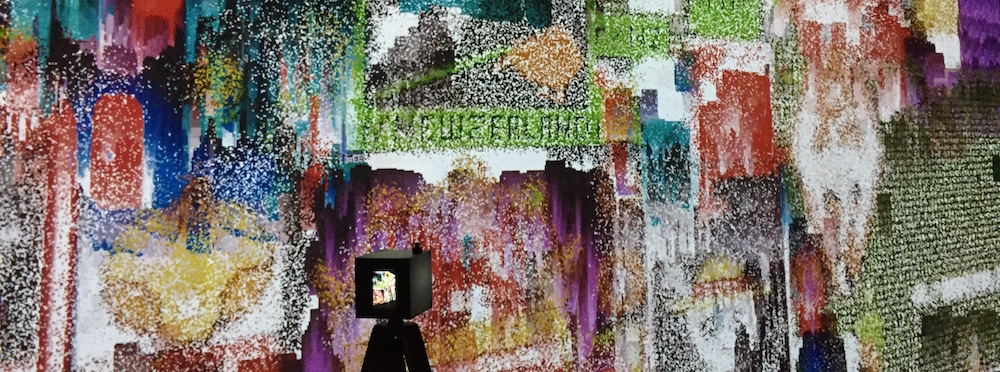
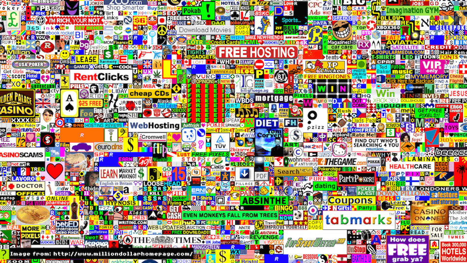

+++

image = "portfolio/metapixels/metapixel_ex.png"
showonlyimage = true
date = "2020-12-24T19:44:32+05:30"
title = "MetaPixels"
draft = false
weight = 2

+++

 

## 
"MetaPixels"는 디지털 이미지의 픽셀을 낯설게 건드리는 여러 대의 카메라를 제작하고, 이들과 디지털 이미지 사이에서 발생하는 일대다 피드백의 설치 작업이다.

일반적인 카메라는 대상의 이미지를 찍는다. 그러나 "메타픽셀 카메라"는 단순히 대상의 이미지만을 찍는게 아니라 이미지를 구성하는 각각의 픽셀에 메시지를 보내는 카메라다.

점점 고해상도로 발전하는 기술에 의해  픽셀은 디지털 스크린의 수면 아래로 숨어버렸다. 픽셀은 실재하지만 더 이상 감각할 수 없는 디지털의 원자적 존재가 되었다. “메타픽셀 카메라”는 픽셀을 커뮤니케이션이 가능한 대상(Object)으로 바라보고 메시지를 보낸다. 메시지를 통해 각각의 픽셀들은 행위자(Actor)로서 스크린 위에 다시 존재하게된다.

셔터를 누르는 순간 카메라가 바라보는 이미지 속의 수많은 픽셀들에게 언어, 그리고 동시에 코드인 메시지가 전달된다. 이미지를 구성하는 부분적 요소로서만 존재하던 각각의 픽셀은 메시지를 받아 "행동할 수 있는 개별 존재자 (Actor)"가 되고, 픽셀의 행위로 만들어진 새로운 이미지는 다시 카메라의 입력으로 되먹임된다. 이를 통해 픽셀들은 메타픽셀로서 피드백된다.

이 작품은 "[Feedback of MetaPixels (2017)](/works/feedback-of-metapixels)"의 두번째 버전으로 개별 행위자로서의 픽셀의 특성을 더욱 동적으로 부각시키고, 다른 메시지를 가진 여러대의 카메라가 만드는 픽셀의 상호작용이 세로로 세워진 스크린월을 통해 대비되어 "기술 발전으로 인해 존재를 잊은 디지털 대상"을 새롭게 감각하고 사유할 수 있는 계기를 만들고자 한다.

오늘날의 속도감 있는 기술 발전 속에서 "존재를 잊은 디지털 대상"을 우리는 다시 찾아내고 읽어낼 수 있을까?

## 초기 이미지의 선택
픽셀에 대해 다른 관점을 보여준 2개의 사건을 MetaPixels 작업의 초기 이미지로 선택하였다. 각 작업은 디지털 이미지의 원자적 존재인 픽셀이라는 대상에 대해 시간성과 돈($1)이라는 가치를 부여하면서 새로운 관점을 실험하였다. 이 이미지에 대해 PROTOROOM은 메타미디어 속성을 부여하는 메시지를 보내면서 디지털의 원자적 존재를 다시보기를 하려고 했다.

#### <https://draemm.li/various/place-atlas/>

reddit.com/r/place - Place는 2017년 만우절, 소셜 네트워킹 사이트인 Reddit에서 시행한 사회적 실험이었다. Reddit 사용자는 16 색 팔레트에서 단일 픽셀의 색상을 골라  reddit.com/r/place 에 있는 온라인 캔버스를 수정하였다. 하나의 픽셀을 찍은 후에는 5 분에서 20 분정도의 시간이 흐른 후에야 다음 픽셀을 찍을 수 있었다. 백만 명이 넘는 사용자가 캔버스를 편집하여 총 약 1,600 만 개의 타일을 배치하였다. 이 실험은 Reddit과 같은 온라인 커뮤니티와 인터넷 문화의 다양성을 보여주는 집단 창작이다. - 위키피디아

#### <http://www.milliondollarhomepage.com/>

밀리언 달러 홈페이지(영어: The Million Dollar Homepage)는 영국 윌트셔 출신 학생인 알렉스 튜(Alex Tew)가 자신의 대학교 교육에 들어갈 학비를 벌 목적으로 2005년에 개설한 웹사이트이다. 이 홈페이지는 1000 × 1000 픽셀 그리드로 된 백만 화소로 이루어져 있다. 이 홈페이지에 있는 이미지 기반 링크는 10 × 10 블록씩 한 화소 당 1달러에 팔려나갔다. 화소 블록을 구매한 사람들이 조그마한 그림들을 제공하면 올라간 그림들이 URL에 연결되었고 이렇게 연결된 링크 위에 커서를 가리키면 표어가 나타난다. 이 웹사이트는 그림 안에 있는 모든 화소를 판매하여 창작자에게 백만 달러의 소득을 안겨다주는 것을 목표로 만든 것이다. 월 스트리트 저널은 이 사이트가 화소를 판매하는 다른 웹사이트들에 영향을 주었다고 언급하였다. - 위키피디아

